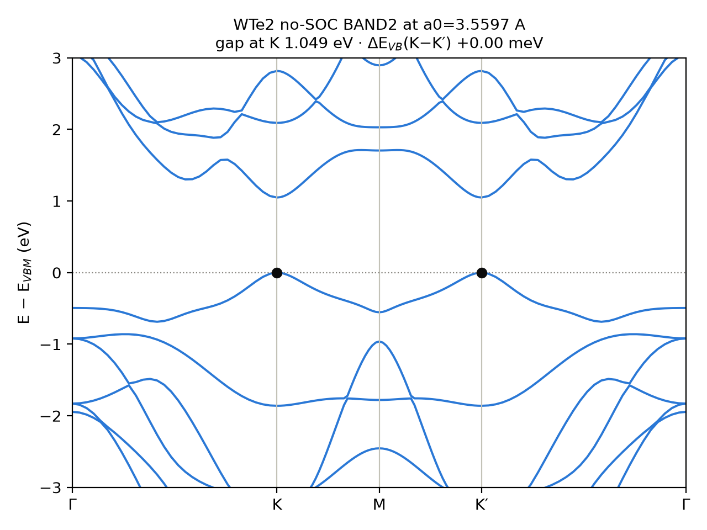

# J001 — 2H-WTe2 Monolayer Convergence & Structural Benchmark

**Project:** P4 — ML-Guided Systematic Screening of 2D Heterostructures for Room-Temperature Valley Polarization
**Benchmark:** J001 — 2H-WTe2 monolayer
**Date:** 2026-10-05
**Status:** COMPLETED

---

## 1. Objective

Fix the numerical baseline for P4 before any heterostructure calculation: plane-wave cutoff, k-point sampling and the PBE in-plane lattice constant of the 2H-WTe2 host. All J001 runs are non-magnetic and without spin–orbit coupling.

## 2. System

| Item | Value |
|---|---|
| Structure | 2H-WTe2 monolayer, 3 atoms (1 W, 2 Te) |
| Space group | P-6m2 (#187) |
| Starting cell | a = 3.550 Å (seed), c = 23.60 Å (about 20 Å vacuum), Te–Te thickness 3.60 Å |
| Built with | ASE `mx2`, via `setup_j001.py` |

## 3. Method

| Setting | Value |
|---|---|
| Code | VASP 6.3.2 (`vasp_std`) on Purdue Anvil (GCC 11.2.0, OpenMPI 4.1.6, MKL 2019.5) |
| Functional | PBE (from the POTCARs) |
| Spin / SOC | non-magnetic (`ISPIN = 1`), no SOC |
| Electronic | `PREC = Accurate`, `EDIFF = 1E-6`, `ISMEAR = 0`, `SIGMA = 0.05`, `LREAL = .FALSE.` |
| k-points | Γ-centred N×N×1 |
| E–a relaxations | `IBRION = 2`, `ISIF = 2`, `NSW = 60`, `EDIFFG = -0.01` |
| Resources | `shared` partition, 1 node, 8 MPI ranks, `OMP_NUM_THREADS = 1`, account nnt250008 |
| Convergence target | \|E − E_ref\| < 1 meV/atom against the most precise run, held by every denser setting |

PAW datasets (PBE.54):

```text
PAW_PBE W_sv 04Sep2015   (14 valence electrons)
PAW_PBE Te 08Apr2002     (6 valence electrons)
```

## 4. Plane-wave cutoff (k = 12×12×1, a = 3.55 Å; reference 600 eV)

| ENCUT (eV) | E/atom (eV) | \|ΔE\| vs 600 eV (meV/atom) |
|---:|---:|---:|
| 350 | −6.475002 | 0.348 |
| 400 | −6.475194 | 0.156 |
| 450 | −6.475245 | 0.105 |
| 500 | −6.475279 | 0.071 |
| 550 | −6.475308 | 0.042 |
| 600 | −6.475350 | reference |

Energy decreases monotonically (variational basis); every tested cutoff meets the target.
**Adopted: 500 eV.**

## 5. k-point sampling (ENCUT = 500 eV; reference 21×21×1)

| k-mesh | E/atom (eV) | \|ΔE\| vs 21×21×1 (meV/atom) |
|---:|---:|---:|
| 6×6×1 | −6.474058 | 1.229 (fails) |
| 9×9×1 | −6.475212 | 0.075 |
| 12×12×1 | −6.475279 | 0.008 |
| 15×15×1 | −6.475285 | 0.001 |
| 18×18×1 | −6.475287 | ~0 |
| 21×21×1 | −6.475287 | reference |

Converged from 9×9×1; every denser mesh stays converged. The 500 eV / 12×12×1 point appears in both series with the same energy (−6.475279 eV/atom).
**Adopted: Γ-centred 12×12×1.**

## 6. In-plane lattice constant (E–a scan; 500 eV, 12×12×1)

- 11 cells from 3.45 to 3.65 Å in steps of 0.02 Å, ions relaxed in each.
- Quadratic fit: **a0 = 3.5597 Å (≈ 3.56 Å)**, 0.27 % above the seed.
- The minimum lies inside the scanned range.

## 7. Frozen J001 baseline

| Parameter | Value |
|---|---|
| Functional / PAW | PBE, `W_sv` + `Te` (PBE.54) |
| ENCUT | 500 eV |
| k-mesh (1×1 cell) | Γ-centred 12×12×1 |
| a0 | 3.5597 Å ≈ 3.56 Å |
| SOC / magnetism | off / non-magnetic |

## 8. Computational cost and Slurm provenance

| Calculation | Slurm job | Status | Anvil SUs |
|---|---:|---|---:|
| ENCUT convergence | 21082428 | COMPLETED | 0.2200 |
| Initial duplicate k-point submission | 21084888 | CANCELLED | 0.1664 |
| Final k-point convergence submission | 21084915 | COMPLETED | 0.2176 |
| E–a scan | 21084907 | COMPLETED | 0.7488 |
| **Total J001 resource consumption** | | | **1.3528 SU** |

The k-point convergence calculations were completed across two Slurm submissions. Job 21084888 was an accidentally duplicated submission and was cancelled after three VASP subjobs had completed. Job 21084915 completed the remaining k-point calculation work used for the final convergence result.

The `jobsu` values are the authoritative Anvil accounting values. Parser-reported core-hours represent VASP execution time and are retained separately for performance analysis.

For the final scientific J001 dataset, the duplicate cancelled submission is not treated as an additional convergence point; its resource consumption is reported separately for transparent provenance.

## 9. Scope: what J001 does not establish

- Convergence of the valley splitting ΔE itself (to be checked on the SOC runs).
- Magnetic-layer settings (Hubbard U, magnetic ground state), vdW and dipole corrections (J002, J003).
- Vacuum convergence (c = 23.6 Å was not varied).

## 10. Open checks

- [ ] k-series bookkeeping: parser reports 0.353 core-h for `conv_kpts`, but job 21084915 could use at most 0.218 core-h; look for an earlier job.
- [ ] Refit a0 using the 5 points nearest the minimum; quote 3.56 Å if it agrees within about 0.002 Å.
- [ ] Compare a0 with C2DB once the WTe2 row is verified.
- [ ] Run spglib on the relaxed E–a `CONTCAR` files.
- [ ] Optional vacuum test (J001d).


## 11. No-SOC WTe₂ Band-Structure Validation

A non-spin-polarized, no-spin–orbit-coupling (no-SOC) band-structure calculation was performed for the equilibrium 2H-WTe₂ monolayer using the converged J001 parameters:

- Equilibrium lattice parameter: \(a_0 = 3.5597\) Å
- Plane-wave cutoff: `ENCUT = 500 eV`
- SCF k-mesh: \(12\times12\times1\)
- Spin treatment: `ISPIN = 1` (non-spin-polarized)
- SOC: OFF
- Band path: \(\Gamma-K-M-K'-\Gamma\)

The SCF calculation (Slurm job `21195493`) converged with `EDIFF = 1E-6` and generated the charge-density file `CHGCAR`. The subsequent non-self-consistent band calculation (Slurm job `21195791`) used `ICHARG = 11`, `LMAXMIX = 4`, `NBANDS = 24`, and `NELMIN = 10`.

### 11.1 Calculated Band Structure



*Figure 11. Calculated no-SOC band structure of the 2H-WTe₂ monolayer along the corrected \(\Gamma-K-M-K'-\Gamma\) high-symmetry path. The valence-band maximum and conduction-band minimum occur at K along the calculated path.*

### 11.2 K/K′ Degeneracy Test

The valley points were sampled at:

- \(K=(1/3,1/3,0)\)
- \(K'=(2/3,-1/3,0)\)

The corrected path passed the checker’s geometric validation. The extracted band-edge results were:

| Quantity | Result |
|---|---:|
| Valence-band splitting, K versus K′ | 0.000 meV |
| Conduction-band splitting, K versus K′ | 0.000 meV |
| Largest K/K′ difference among the lowest 15 states | 0.000 meV |

Within the precision of the extracted eigenvalues, the K and K′ states are degenerate in the no-SOC, nonmagnetic WTe₂ calculation. This is consistent with the expected time-reversal symmetry of the baseline system and indicates that no artificial K/K′ splitting was detected.

### 11.3 Band Edges and Valley Offsets

The corrected band calculation yielded the following results:

| Quantity | Result |
|---|---:|
| Direct band gap at K | 1.0491 eV |
| Valence-band maximum (VBM) | K |
| \(E_{\mathrm{VB}}(K)-E_{\mathrm{VB}}(\Gamma)\) | +0.4942 eV |
| Lowest conduction valley away from K/K′ | Q, along Γ–K |
| \(E_{\mathrm{CB}}(Q)-E_{\mathrm{CB}}(K)\) | +0.2528 eV |

The direct band gap at K is approximately 1.049 eV. The valence-band offset indicates that K lies 0.4942 eV above Γ, while the Q-valley conduction edge lies 0.2528 eV above the conduction-band minimum at K.

These offsets provide useful baseline margins for subsequent heterostructure calculations. The K valley must remain the relevant valence maximum and conduction minimum for K-valley-based functionality to be retained.

The reported 1.0491 eV value is the direct gap at K; it is not asserted to be the global fundamental gap without a separate global band-edge assessment.

### 11.4 Band-to-SCF Consistency

The corrected band energies were compared with the corrected SCF eigenvalues at common k-points:

| k-point | Bands compared | Band − SCF differences |
|---|---|---|
| K | 12–15 | 0.06, 0.10, 0.11, 0.07 meV |
| Γ | 12–15 | 0.10, 0.08, 0.07, 0.07 meV |

Both comparisons passed the checker’s consistency test, with all listed differences below 1 meV. This confirms that the corrected band calculation reproduces the corresponding SCF eigenvalues to sub-meV accuracy for the states examined.

### 11.5 Computational Provenance

| Calculation | Slurm job | Status | Wall time | Anvil usage |
|---|---:|---|---:|---:|
| Corrected no-SOC SCF (SCF2) | 21195493 | COMPLETED | 00:01:05 | 0.1448 SU |
| Corrected no-SOC BAND (BAND2) | 21195791 | COMPLETED | 00:01:34 | 0.2088 SU |
| **Subtotal** | | | | **0.3536 SU** |

The corrected SCF used eight MPI ranks with one thread per rank. The corrected band calculation used the new SCF charge density and the first-Brillouin-zone representation \(K'=(2/3,-1/3,0)\).

### 11.6 Interpretation and Next Step

The corrected no-SOC calculation passes the three required validation checks:

1. The \(\Gamma-K-M-K'-\Gamma\) path is geometrically valid.
2. The K/K′ valley-edge splitting is zero within the precision of the extracted eigenvalues.
3. The corrected band eigenvalues agree with the SCF at the tested common k-points to sub-meV accuracy.

The no-SOC, nonmagnetic WTe₂ monolayer therefore provides a validated control baseline for investigating the effects of spin–orbit coupling and magnetic proximity in subsequent P4 calculations.

The next stage will examine WTe₂ with SOC while retaining the same equilibrium structure, allowing changes in the band dispersion and spin splitting to be compared against this no-SOC reference.


## 12. Computational Cost and Slurm Provenance

### Complete resource accounting

The following table records all J001-related Anvil jobs whose
resource usage has been measured.

| Calculation | Slurm job | Status | Anvil SUs |
|---|---:|---|---:|
| ENCUT convergence | 21082428 | COMPLETED | 0.2200 |
| Duplicate k-point submission | 21084888 | CANCELLED | 0.1664 |
| Final k-point convergence | 21084915 | COMPLETED | 0.2176 |
| E–a scan | 21084907 | COMPLETED | 0.7488 |
| Initial SCF attempt | 21192923 | FAILED | 0.0152 |
| Initial no-SOC SCF | 21193201 | COMPLETED; superseded | 1.3848 |
| Initial no-SOC BAND | 21194532 | COMPLETED; superseded | 0.1888 |
| Corrected no-SOC SCF2 | 21195493 | COMPLETED | 0.1448 |
| Corrected no-SOC BAND2 | 21195791 | COMPLETED | 0.2088 |
| **Total recorded Anvil usage** | | | **3.2952 SU** |

The failed initial SCF job (21192923) terminated because its
Slurm script changed to an incorrect working directory. VASP
could not find INCAR, and no electronic-structure calculation
was performed in that attempt.

The cancelled k-point job (21084888) consumed 0.1664 SU before
cancellation. Three VASP subjobs had completed before the duplicate
submission was cancelled.

The initial SCF and BAND calculations were retained for diagnostic
comparison. The corrected no-SOC baseline uses SCF2 and BAND2.

### Accepted workflow cost

Excluding the cancelled duplicate submission, the failed initial SCF,
and the superseded initial SCF/BAND pair, the accepted calculation
sequence consists of:

| Calculation | Anvil SUs |
|---|---:|
| ENCUT convergence | 0.2200 |
| Final k-point convergence | 0.2176 |
| E–a scan | 0.7488 |
| Corrected no-SOC SCF2 | 0.1448 |
| Corrected no-SOC BAND2 | 0.2088 |
| **Accepted workflow subtotal** | **1.5400 SU** |

This subtotal represents the accepted convergence, structural, and
corrected no-SOC electronic-structure workflow. It is distinct from
the total Anvil usage of 3.2952 SU across all attempts.

The `jobsu` values are used as the authoritative scheduler accounting
values. Parser-reported core-hours and `seff` CPU efficiency are
recorded separately as performance metrics.